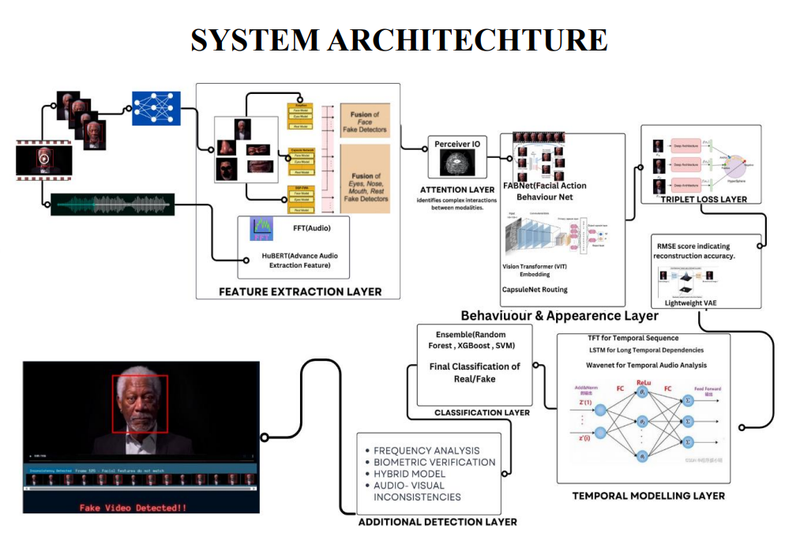

# System Architecture

This document describes the architecture of the deepfake detection system.

## Overview

The system is composed of several layers that work together to detect deepfakes in video and audio content. The main components are:

- **Feature Extraction Layer**: 
  - **Visual Features**: Extracted using FABNet, Xception, and Vision Transformers.
  - **Audio Features**: Extracted using FFT and HuBERT.

- **Attention Layer**: 
  - Identifies interactions between audio and visual modalities.

- **Behaviour & Appearance Layer**: 
  - Utilizes ensemble learning techniques (Random Forest, XGBoost, SVM) for final classification.

- **Temporal Modelling Layer**: 
  - Analyzes temporal sequences using LSTMs and Wavenets for audio analysis.

- **Additional Detection Layer**: 
  - Incorporates frequency analysis, biometric verification, and hybrid models for enhanced detection accuracy.

## Flowchart

## Dependencies

The following dependencies are required for this system:
- TensorFlow
- OpenCV
- Dlib
- Librosa
- NumPy
- Scikit-learn
- Pandas
